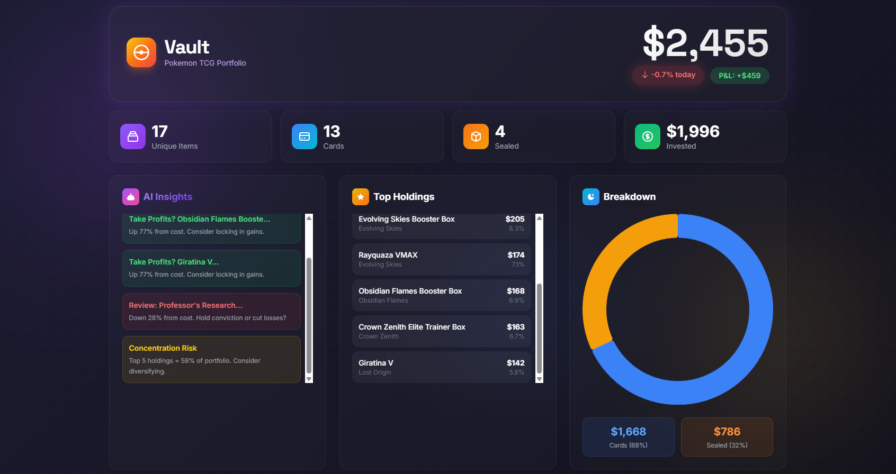
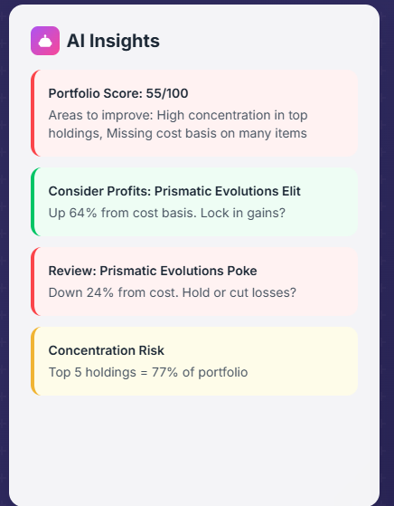
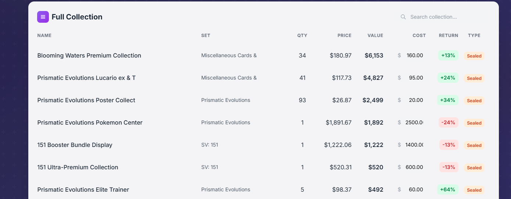

# Vault - Pokemon TCG Portfolio Tracker

<div align="center">


**A beautiful, modern web dashboard to track your Pokemon TCG collection value with AI-powered insights.**

[Live Demo](#) | [Features](#features) | [Installation](#installation) | [Screenshots](#screenshots)

</div>

---

## Screenshots

<div align="center">

### Dashboard Overview


### Portfolio Analytics


### Collection Table


</div>

---

## Features

### Portfolio Tracking
- Import collections from **Collectr CSV exports**
- Real-time price fetching from **Pokemon TCG API**
- Track **cards** and **sealed products** separately
- Store price history for trend analysis

### Beautiful Dashboard
- **Animated gradient backgrounds** with floating orbs
- **Glassmorphism UI** with modern card design
- **Responsive design** - works on desktop and mobile
- **Staggered animations** for smooth page loads

### Financial Analytics
- **Total portfolio value** with daily change tracking
- **P&L calculation** - enter cost basis to see returns
- **Concentration analysis** - identify overweight positions
- **Top holdings** with percentage breakdown

### AI-Powered Insights
- **Portfolio health score** (0-100)
- **Profit-taking recommendations** for big winners
- **Loss review alerts** for underperformers
- **Diversification warnings** for concentrated portfolios

### Data Management
- **SQLite database** - lightweight, no server needed
- **CSV import/export** functionality
- **Price history** stored for each item
- **Editable cost basis** with auto-save

---

## Tech Stack

| Technology | Purpose |
|------------|---------|
| **Python 3.10+** | Backend language |
| **Flask** | Web framework |
| **SQLite** | Database |
| **Tailwind CSS** | Styling |
| **Chart.js** | Data visualization |
| **Pokemon TCG API** | Price data |

---

## Installation

### Prerequisites
- Python 3.10 or higher
- pip package manager

### Local Setup

```bash
# Clone the repository
git clone https://github.com/PryceWayne/vault.git
cd vault

# Install dependencies
pip install -e .

# Import your collection (Collectr CSV export)
vault import your_collection.csv

# Update prices from Pokemon TCG API
vault update

# Launch the web dashboard
vault web
```

Open http://localhost:5000 in your browser.

### CLI Commands

| Command | Description |
|---------|-------------|
| `vault import <csv>` | Import from Collectr CSV |
| `vault update` | Refresh prices from API |
| `vault summary` | Show portfolio summary |
| `vault list` | List all items |
| `vault web` | Launch web dashboard |
| `vault export` | Export to CSV |

---

## Deployment

### Deploy to Railway (Recommended)

1. Fork this repository
2. Go to [Railway.app](https://railway.app)
3. Click "New Project" → "Deploy from GitHub"
4. Select your forked repo
5. Railway will auto-detect the Procfile and deploy

### Deploy to Render

1. Fork this repository
2. Go to [Render.com](https://render.com)
3. Create new "Web Service"
4. Connect your GitHub repo
5. Set build command: `pip install -r requirements.txt`
6. Set start command: `gunicorn vault.web:app`

---

## CSV Format (Collectr Export)

The importer expects these columns from Collectr:

```
Portfolio Name, Category, Set, Product Name, Card Number,
Rarity, Variance, Grade, Card Condition, Average Cost Paid,
Quantity, Market Price, Price Override, Watchlist, Date Added, Notes
```

---

## Database Schema

```sql
-- Items table
items (
    id, name, set_name, card_number, rarity, variance,
    quantity, cost_basis, is_sealed, api_id, portfolio_name,
    grade, condition, notes, date_added, created_at, updated_at
)

-- Price history
prices (id, item_id, price, timestamp)

-- Alerts (future feature)
price_alerts (id, item_id, threshold_pct, direction, triggered_at)
```

---

## API Endpoints

| Endpoint | Method | Description |
|----------|--------|-------------|
| `/` | GET | Main dashboard |
| `/api/analysis` | GET | Portfolio analysis JSON |
| `/api/items` | GET | All items JSON |
| `/api/items/<id>/cost` | POST | Update cost basis |

---

## Contributing

Contributions are welcome! Please feel free to submit a Pull Request.

1. Fork the repository
2. Create your feature branch (`git checkout -b feature/AmazingFeature`)
3. Commit your changes (`git commit -m 'Add some AmazingFeature'`)
4. Push to the branch (`git push origin feature/AmazingFeature`)
5. Open a Pull Request

---

## License

This project is licensed under the MIT License - see the [LICENSE](LICENSE) file for details.

---

## Acknowledgments

- [Pokemon TCG API](https://pokemontcg.io/) for price data
- [Collectr](https://www.collectr.com/) for CSV export format
- [Tailwind CSS](https://tailwindcss.com/) for styling
- [Chart.js](https://www.chartjs.org/) for charts

---

<div align="center">

**Built with love for Pokemon TCG collectors**

Made by [Pryce Hedrick](https://github.com/PryceWayne)

</div>
